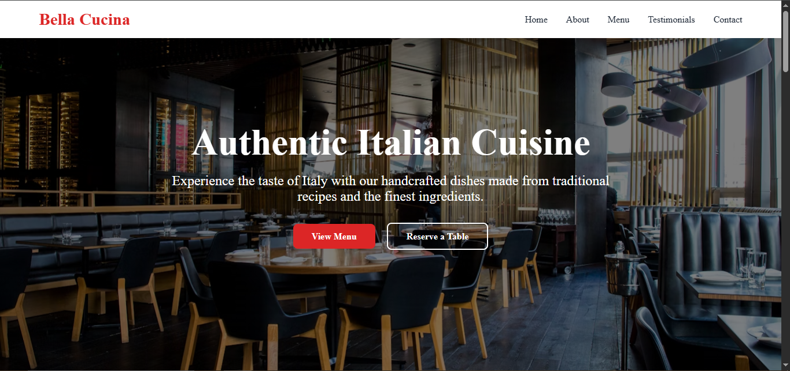

# 🍝 Bella Cucina - Authentic Italian Restaurant Website



A responsive, modern website for Bella Cucina, an authentic Italian restaurant showcasing their menu, story, testimonials, and reservation system.

## 🚀 Features

- **Responsive Design**: Works flawlessly on all devices
- **Interactive Menu**: Beautifully organized food categories
- **Reservation System**: Online table booking form
- **Customer Testimonials**: Star-rated reviews with user photos
- **Smooth Animations**: Elegant scroll and hover effects
- **Mobile-Friendly Navigation**: Hamburger menu for smaller screens

## 🛠 Technologies Used

**Frontend:**
- HTML5, CSS3, JavaScript
- CSS Grid & Flexbox for layouts
- Font Awesome for icons
- Google Fonts (Playfair Display & Poppins)

## 📂 Project Structure

bella-cucina/
├── index.html # Main HTML file
├── style.css # All styling
├── script.js # Interactive functionality
├── images/ # Local image assets
│ ├── food1.jpg
│ ├── food2.jpg
│ └── food3.jpg
├── screenshots/ # Website previews
│ ├── homepage.png
│ ├── menu.png
│ └── contact.png
└── README.md # This file

text

## 🖥️ Live Demo

[View Live Demo](https://ayesha-emaan.github.io/Italian-Restaurant-Website/) 

## 🛠️ Installation & Setup

1. Clone the repository:
   ```bash
   git clone https://github.com/Ayesha-Emaan/bella-cucina.git
Navigate to project directory:

bash
cd bella-cucina
Open in your browser:

Simply open index.html in any modern browser
 
📝 Customization
## To customize this website for your restaurant:

-Replace images in /images folder
-Update menu items in index.html
-Change color scheme in style.css (modify CSS variables)
-Update contact information in the Contact section

📬 Contact
For questions or customization requests:
Email: emaanayesha50@gmail.com

